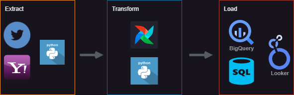
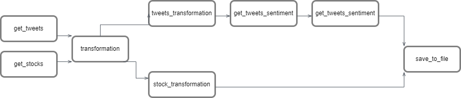
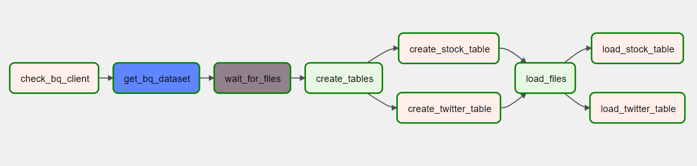
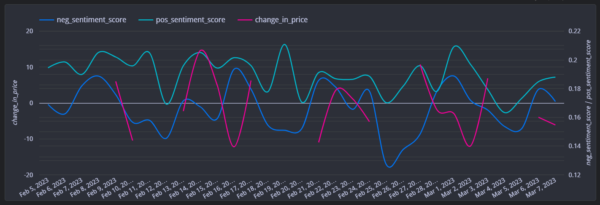
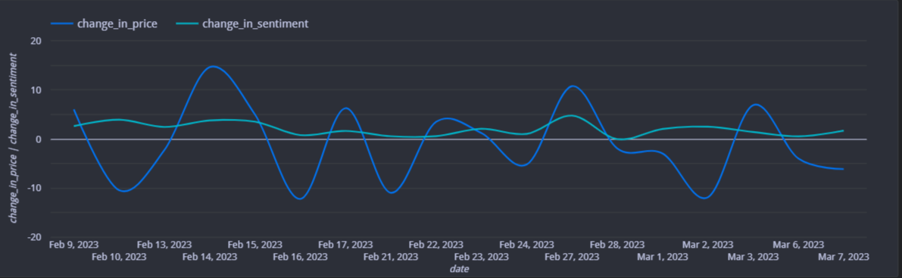

# Twitter Sentiment Analysis and Influence on Stock Performance

#### By [Chloe (Yen Chi) Le](https://www.linkedin.com/in/chloeycl/) 


## Technologies Used

* Python
* Snscrape 
* Yfinance
* Jupyter
* Airflow
* BigQuery
* Looker Studio
* SQL
* Pandas
* `requirements.txt`
  

## Target Websites

1. Twitter 
2. Yahoo!Finance

## Description

  

My plan for this project is to create an end-to-end **ETL pipeline**:
  - **Extract**: Load data from any data sources or scrape data from websites
  - **Transform**: Make data usable
  - **Load**: Load them to data warehouse

The **E** and **T** in ETL pipeline will be implemented on Airflow as: 
  * Scrape tweets from *Twitter* using `Snscrape` to get the specific cashtags, and *$TSLA* historical stock prices on *Yahoo!Finance* using `yfinance`
  * For Tweets on *Twitter*: perform data cleansing, sentiment analysis using Python
  * For *$TSLA*: perform data cleansing using Python
  
<p align="center">
  
</p>

The **L** in ETL pipeline that implemented on Airflow is:
  * Check the existence of the dataset in `BigQuery` using `BigQueryGetDatasetOperator`
  * If dataset is created and the files are detected in data folder using `FileSensor`, they will be load to `BigQuery`

<p align="center">
  
</p>

<br>

## Data Visualizations:
Once the datasets were cleaned and consolidated, I created data visualizations and analysis (using Looker Studio).

* Below is the line chart that shows the correlation among neg_sentiment, pos_sentiment and change_in_price for *$TSLA* on weekdays. (click on image of chart to use dashboard):

<br>

<p align="center">

[](https://lookerstudio.google.com/s/tbptIw7Wbv0)

</p>

<br>

   The chart information is generated by the `Custom Query` below:  
  ```sql
  WITH
--calculate pos_sentiment per day
pos_sentiment as (
  SELECT avg(score) as pos_sentiment_score, date, sentiment FROM `SIA_Stocks.twitter`
  WHERE sentiment = 'positive'
  GROUP BY date, sentiment
  ), 

--calculate neg_sentiment per day
neg_sentiment as (
  SELECT avg(score) as neg_sentiment_score,date , sentiment FROM `SIA_Stocks.twitter`
  WHERE sentiment = 'negative'
  GROUP BY date, sentiment
),

--join
join_sentiment as (
  SELECT p.pos_sentiment_score,n.neg_sentiment_score, p.date, from pos_sentiment p
  INNER JOIN neg_sentiment n
  ON p.date = n.date
),

--calculate change_in_price
stock as (
  SELECT 
  date, avg(close) close,
  LAG(avg(close)) OVER (ORDER BY date) as yesterday,
  avg(close) - (LAG(avg(close)) OVER (ORDER BY  date)) as change_in_price,
  FROM SIA_Stocks.historial_stock_prices
  GROUP BY date
  ORDER BY date
),

--join stock and sentiment tables
final as(
  SELECT j.date, s.close, s.yesterday, s.change_in_price, j.pos_sentiment_score,j.neg_sentiment_score
  FROM join_sentiment j 
  LEFT JOIN stock s
  ON s.date = j.date
  ORDER BY j.date
)
select * from final;
  ```
<br>

* I also created another line chart to show correlation between change in sentiment and change in price (click on image of chart to use dashboard):

<p align="center">

[](https://lookerstudio.google.com/s/tbptIw7Wbv0)

</p>

## Setup/Installation Requirements

* Go to https://github.com/ChloeL6/Financial-Sentiment-Analysis.git to find the specific repository for this website.
* Then open your terminal. I recommend going to your Desktop directory:
    ```bash
    cd Desktop
    ```
* Then clone the repository by inputting: 
  ```bash
  git clone https://github.com/ChloeL6/Financial-Sentiment-Analysis.git
  ```
* Go to the new directory or open the directory folder on your desktop:
  ```bash
  cd Financial-Sentiment-Analysis
  ```
* Once in the directory you will need to set up a virtual environment in your terminal:
  ```bash
  python3 -m venv venv
  ```
* Then activate the environment:
  ```bash
  source venv/bin/activate
  
* With your virtual environment now enabled with proper requirements, open the directory:
  ```bash
  code .
  ```
* Upon launch please update the Google Cloud client and project details to configure it to load to your project

* Once VS Code is open, then run the setup file:
  ```bash
  ./setup.sh
  ```

    The contents of the `setup.sh` include the below to install:

    1. Relevant version of python
    2. Create virtual env
    3. Installing Airflow in virtual env
    4. Requirements.txt

    ```bash
    #/bin/bash
    # this script will setup the environment and install all necessary components 

    # install/upgrade virtualenv
    python3 -m pip install --upgrade virtualenv

    # create and run a python3 virtual env
    python3 -m venv venv
    source venv/bin/activate

    # install/upgrade pip
    python3 -m pip install --upgrade pip setuptools wheel

    # install Airflow in the virtual env
    AIRFLOW_VERSION=2.3.2
    PYTHON_VERSION=3.7
    CONSTRAINT_URL="https://raw.githubusercontent.com/apache/airflow/constraints-${AIRFLOW_VERSION}/constraints-${PYTHON_VERSION}.txt"
    pip install "apache-airflow[async,postgres,google]==${AIRFLOW_VERSION}" --constraint "${CONSTRAINT_URL}"

    # pip install pypi packages
    pip install -r requirements.txt
    ```

* Then run the airflow setup file:

  ```bash
  ./airflow_setup.sh
  ```
    
    The contents of the `airflow_setup.sh` include the below to:

    1. Creating ./logs and ./plugins directories in the dsa-airflow directory 
    2. Download the `docker_compose.yaml` 
    3. Create the .env 
    4. Initialize airflow
    
  ```bash
    #!/bin/bash
    # Move into the dsa-airflow directory and make subdirs
    cd dsa-airflow

    # download the docker-compose.yaml and set the .env
    curl -LfO 'https://airflow.apache.org/docs/apache-airflow/stable/docker-compose.yaml'
    echo "AIRFLOW_UID=$(id -u)\nAIRFLOW_GID=0" > .env

    # initialize airflow 
    docker-compose up airflow-init
  ```

* Once airflow has been initialized, use the below command line tool that allows you to initialize the rest of the Docker containers:
        ```bash
        docker-compose up
        ```

* You will need to create a file connection for the `data/` folder. To do so go to the airflow GUI and click Admin -> Connections and then create a new connection with the below config and click save:

    


* You will need to create a cloud connection for the `BigQueryTableExistenceSensor` folder to work:
    * Connection Id: google-cloud-default
    * Connection Type: Google BigQuery

* Once this is all setup, in the Airflow GUI 1) enable your DAG and 2) trigger it to run. From there go to your VS Code and run the below command from inside the data directory:

    ```bash
    ./get_data.sh
    ```
This will download the CSV file to your local filesystem in the data folder, which will trigger the file sensor and start the DAG.

* Once setups have been completed, you will want to be using the below commands to manage airflow and docker:
    
    1. In order to shut down hit `^Ctrl C` to stop Airflow on the local host and then run the below to stop the containers and remove old volumes:
        ```bash
        docker-compose down --volumes --remove-orphans 
        ```
    2. Use the below command line tool if you want to re-initialize the rest of the Docker containers:
        ```bash
        docker-compose up
        ```

</br>

## Known Bugs

* No known bugs

<br>

## License

MIT License

Copyright (c) 2022 Chloe (Yen Chi) Le

Permission is hereby granted, free of charge, to any person obtaining a copy of this software and associated documentation files (the "Software"), to deal in the Software without restriction, including without limitation the rights to use, copy, modify, merge, publish, distribute, sublicense, and/or sell copies of the Software, and to permit persons to whom the Software is furnished to do so, subject to the following conditions:

The above copyright notice and this permission notice shall be included in all copies or substantial portions of the Software.

THE SOFTWARE IS PROVIDED "AS IS", WITHOUT WARRANTY OF ANY KIND, EXPRESS OR IMPLIED, INCLUDING BUT NOT LIMITED TO THE WARRANTIES OF MERCHANTABILITY, FITNESS FOR A PARTICULAR PURPOSE AND NONINFRINGEMENT. IN NO EVENT SHALL THE AUTHORS OR COPYRIGHT HOLDERS BE LIABLE FOR ANY CLAIM, DAMAGES OR OTHER LIABILITY, WHETHER IN AN ACTION OF CONTRACT, TORT OR OTHERWISE, ARISING FROM, OUT OF OR IN CONNECTION WITH THE SOFTWARE OR THE USE OR OTHER DEALINGS IN THE SOFTWARE.

</br>
